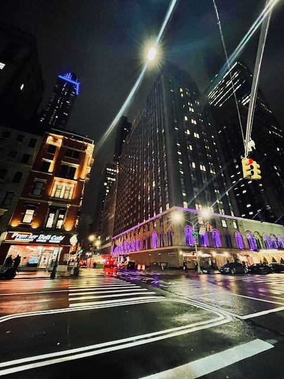
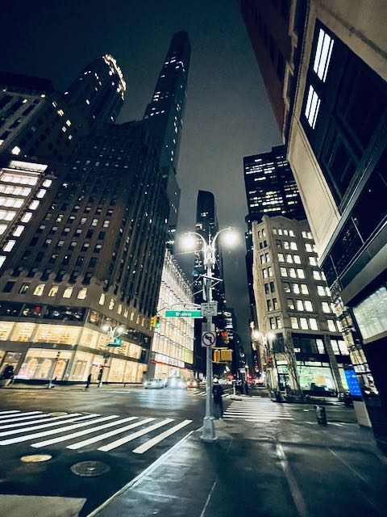

<html>
<head>
<style>
p {
font-family: avenir;
font-size: 100%;
  border: 3px solid lightpink;
  padding: 30px;
}

h1 {
font-family: avenir;
font-size: 170%;
}


</style>
</head>
<body>


<h1> Onyeka Isamah, *MPH [Candidate]*</h1>

<center>

</center>

<center>

<p class="text-muted">


Hi! My name is **Onyeka**. I will be getting my Masters in Public Health [Epidemiology w/ Advanced Certificate in Applied Biostats and Public Health Data Science from Columbia University.</p>

<p class="text-muted">
I really enjoy coding and continuing to learn about R. Outside of building myself as an aspiring Data Scientist, I love to take photos. I haven't taken any in quite sometime now, but I'm hoping as a phase out of academia, I can spend more time developing my hobby.
Anyways, click the menu button to learn more about me! </p>


<blockquote class="blockquote-reverse">
  <p>It's the possibility of having a dream come true that makes life interesting.</p>
  <small>Paulo Coehlo* <cite title="The Alchemist"> The Alchemist </cite></small>
</blockquote>


</center>


<center>


</center>


<center>


</center>


---------


```{r setup1, include=FALSE}
#this code helped with some error messages when I was trying to knit.
chooseCRANmirror(graphics=FALSE, ind=1)
remove.packages("yaml")
install.packages("yaml")
```


